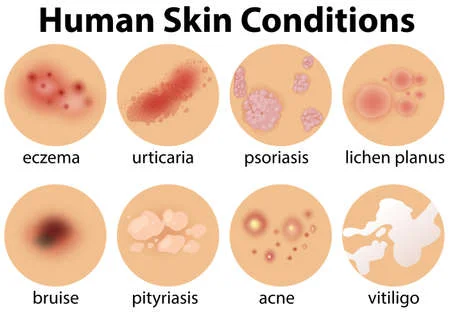
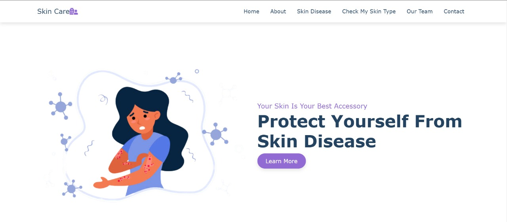
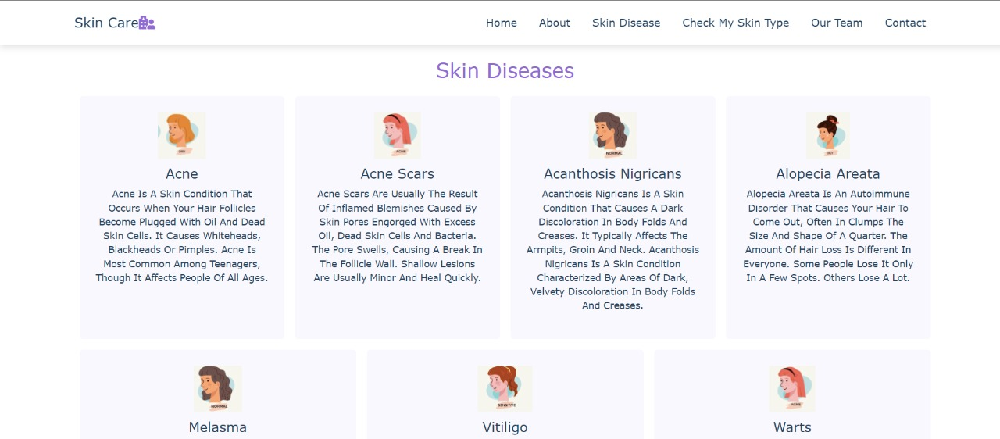
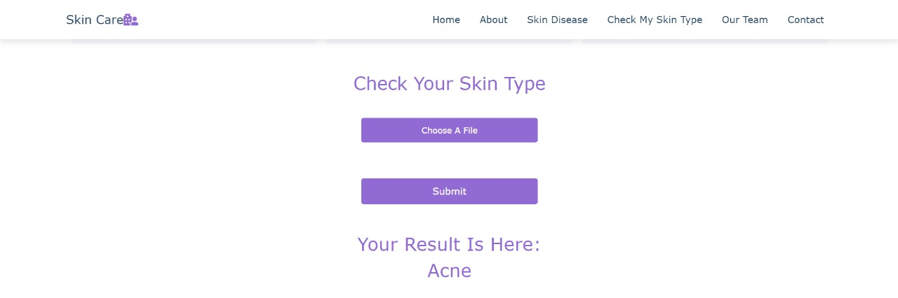
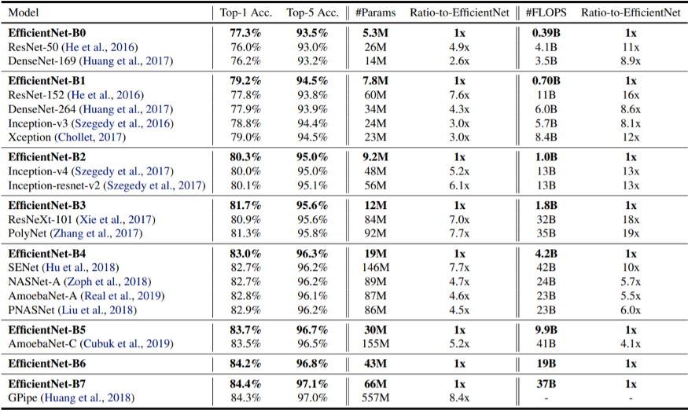
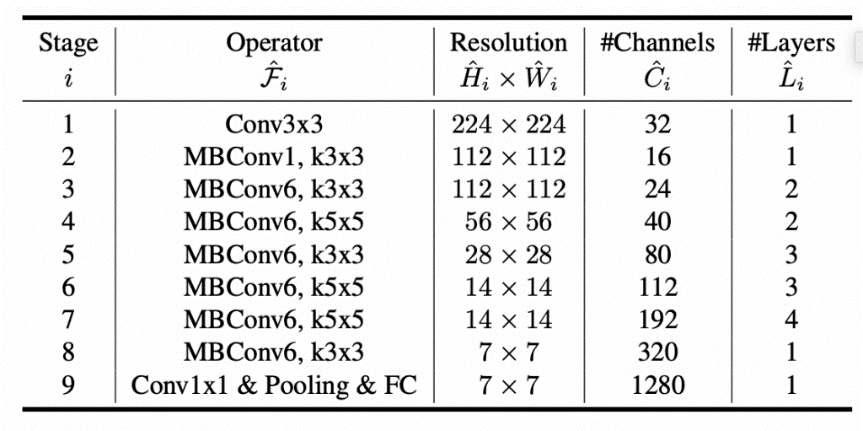

<div align ='center'>
  
# 18CSC305J - AI
### Domain : Machine Learning / AI
  
</div>

### Problem Statement
Build a machine learning model to identify skin conditions and process skin issues into categories such as dryness and oiliness.

### Description
Patients face many problems with their skin. The main issue remains the type of skin they have. Depending on the skin type, various skin conditions can occur. If the skin is too dry, it may start to peel and lead to diseases like psoriasis and eczema. If the skin is too oily, it can lead to pimples and scars. Identifying skin type is therefore very important.

## Classes of Skin Diseases



## Frontend



.jpeg)





.jpeg)

.jpeg)

## Tech Stack

+ PyTorch
+ torchvision
+ Pillow
+ Flask
+ Werkzeug
+ HTML
+ CSS
+ JavaScript
+ Bootstrap

## Model Used

### EfficientNet-B0
This project uses an EfficientNet-based image classification model.
The model is fine-tuned for skin condition classification and is saved as `skin-model-pokemon.pt` in the repository root.





The model loads pre-trained weights and fine-tunes later layers for the target classes.

## Project Structure

- `run.py` - starts the Flask web app
- `predict.py` - runs a command-line prediction for a single image
- `skin-model-pokemon.pt` - trained PyTorch model file
- `app/` - Flask application package
- `Images/` - project images used in README and the UI

## Available Classes

- acanthosis-nigricans
- acne
- acne-scars
- alopecia-areata
- dry
- melasma
- oily
- vitiligo
- warts

## Installation

1. Open a terminal in the project folder.
2. Create a Python virtual environment:

Windows:
```powershell
python -m venv venv
venv\Scripts\activate
```

macOS / Linux:
```bash
python3 -m venv venv
source venv/bin/activate
```

3. Install dependencies:
```bash
pip install -r requirements.txt
```

## Run the Web App

1. Make sure the upload folder exists:
```bash
mkdir -p app/static/uploads
```
2. Start the Flask app:
```bash
python run.py
```
3. Open your browser at `http://127.0.0.1:5000/`

## Run CLI Prediction

Use the command-line script to predict a single image:
```bash
python predict.py -m skin-model-pokemon.pt -i "path/to/image.jpg"
```

## Notes

- The Flask app loads the model from `skin-model-pokemon.pt`.
- If you use Windows, adjust the activate command to `venv\Scripts\activate`.
- The app uploads files to `app/static/uploads` by default.
